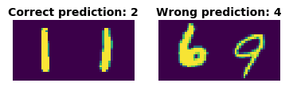

# calculate-sum-mnist
With the help of different set ups of neural networks, classify pairs of MNIST data set samples, calculating their sum. 

### Visualisation of goal (positive and negative example)

## Project structure

The code was written in a Jupyter Notebook file (mostly using Google Collab). Also, in the html file, the outputs of a run are shown.

### Data preparation

First, using the MNIST data set I created pairs of digits (left order and right order). Then, putting aside 90% of data for training (for both orders) and the remaining 10% for validation. I concatenated the validation sets (left and right) into one set and also the test sets into one using Pytorch. Follwing, small visualisation in the script should help showing the situation.

### Setting up different training configurations

After data preparation, different setups are created for using different network configurations (loss functions, optimizers, depth, number of hidden neurons). The models should predict the _mod 10 sum_ of both digits shown in the pair. Maximum depth of models are 3 layers.

### Training phase

Training first on the right order training data set. Selecting the best model. Then concatenate the right and left order training sets and train on this. Plotting training and validation lsos and accuracy per epoch for each model. Then, I selected the best model.

### Evaluating on test set

Evaluate the model selected on the test set and visualizing some examples.